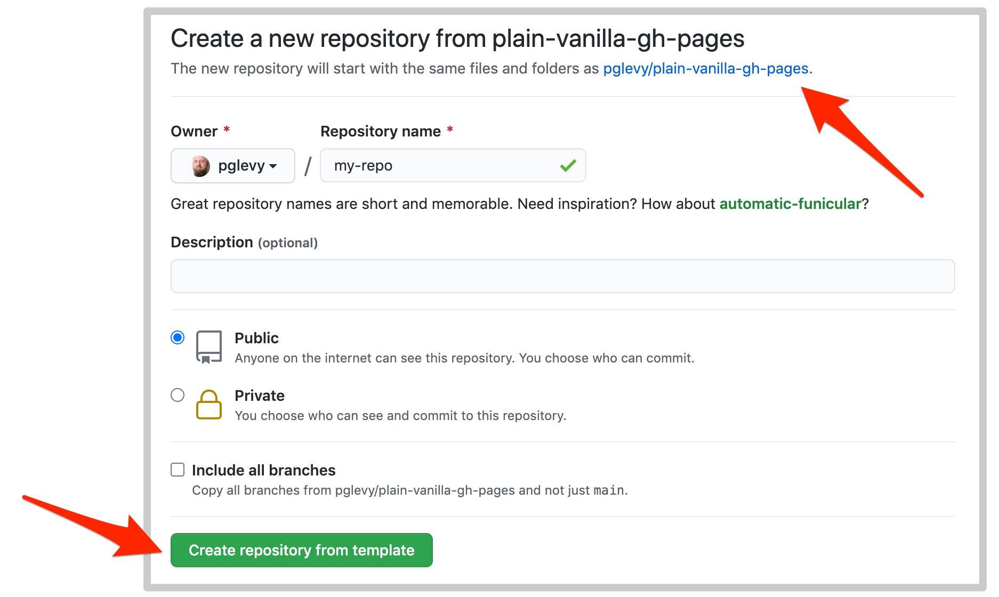

# Plain Vanilla GitHub Pages

<section class="grid">
<article markdown="1">

The purpose of this project is to make it as easy as possible for low-tech people like me to create and host basic web pages for free on [GitHub Pages](https://pages.github.com/).

## How it works

After creating your own copy of this template repository, add new pages as you need them using the Markdown (.md) format. See the [GitHub Flavored Markdown](https://guides.github.com/features/mastering-markdown/) reference for examples of how to add different elements to your pages.

If you want to go beyond Markdown with more layout options and interactive components, you can use the [Pico CSS Framework](https://picocss.com/) with your pages.

</article>

<article>
  <section markdown="1">
  
  </section>
  <section>
    <a href="https://github.com/lowcodelounge/plain-vanilla-gh-pages" role="button" style="display:block">Get the template on GitHub</a>
  </section>
  <a href="https://youtu.be/jlkHEmgQhGU" role="button" class="outline" style="display:block">Watch the tutorial on YouTube</a>
</article>
</section>